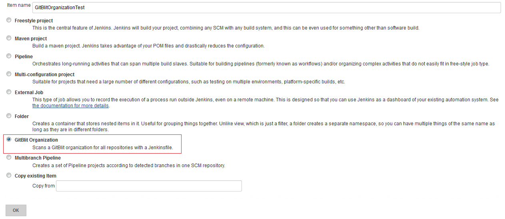
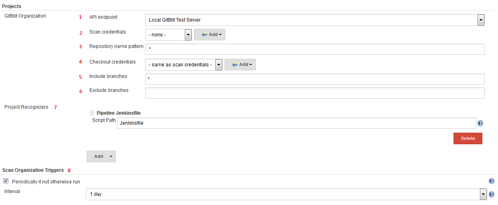

# gitblit-plugin

This plugin allows creating Organization Folders in Jenkins which scan Gitblit servers to create build 
jobs according to the repositories and branches found. This greatly simplifies the management of 
build processes for projects hosted in Gitblit servers.

# How to use this plugin

First of all, go to the Jenkins global configuration and add the Gitblit servers you want to scan 
(Just their URL) with the name you want.  

Then create a new project of type "GitBlit Organization":  

In the project configuration you'll see these settings: (to see them all you have to click the "Advanced" button)  

1: API endpoint: The Gitblit instance which will be scanned by this project. You can choose between 
the Gitblit servers configured in the Jenkins global settings.  
2: Scan credentials: The credentials that would be required to scan the Gitblit server.  
3: Repository name pattern: Here you can specify which repositories should be scanned. It follows the 
patterns specified in [the Java "Pattern" class](https://docs.oracle.com/javase/8/docs/api/java/util/regex/Pattern.html#sum)  
4: Checkout credentials: The credentials that would be needed to perform a Git checkout operation.  
5: Include branches: Here you can specify which branches from every repository should be scanned.  
6: Exclude branches: Here you can specify which branches from every repository should be excluded from the scan.  
7: Project Recognizers: Only the branches which meet the criteria specified here will be scanned. By default, the criteria is 
that the project must contain a Jenkinsfile.  
8: Scan Organization Triggers: Here you can specify the time interval in which the repositories will be periodically scanned.  

Every time you click "Save" in the configuration screen, the scanning will be triggered. To trigger the scanning you can also
click the "Scan Organization Now" action.

## Non-supported features

Standalone Multibranch Pipeline projects with Gitblit Sources are not supported.